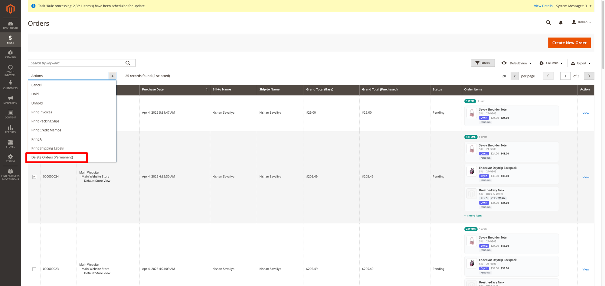
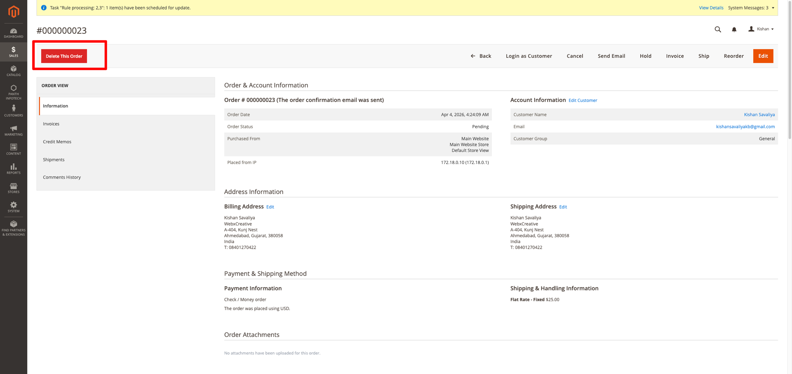
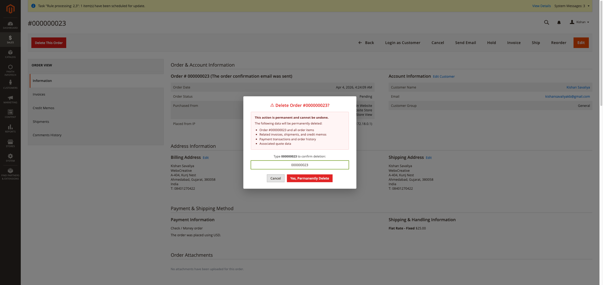
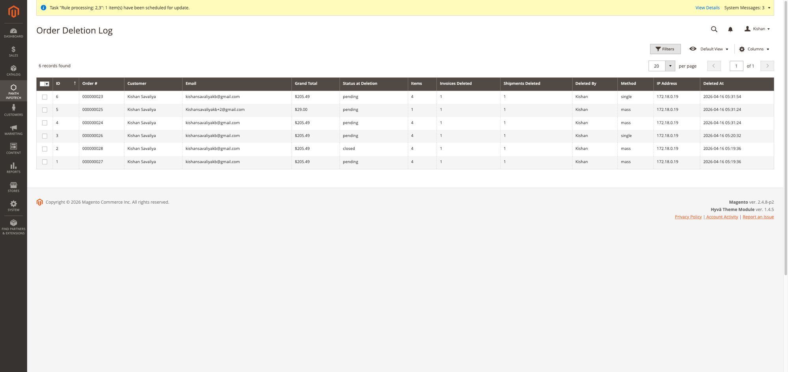
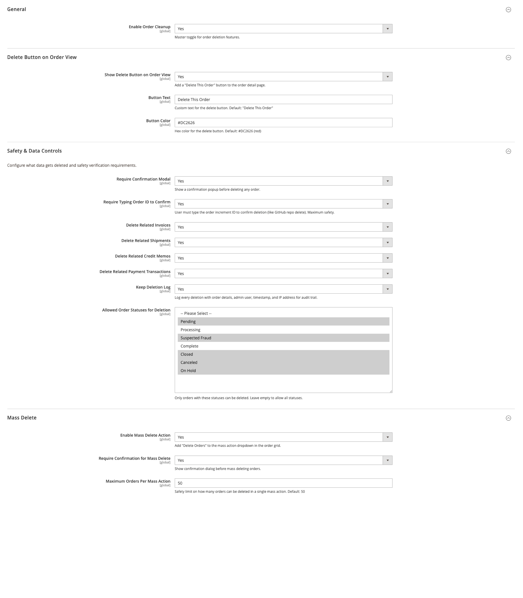

<!-- SEO Meta -->
<!--
  Title: Panth Order Cleanup — Safely Delete Orders from Magento 2 with Double Verification & Audit Log
  Description: Permanently delete test orders, invoices, shipments, credit memos, and payment data from Magento 2 with double verification, configurable safety controls, mass delete, and a complete deletion audit log. Keep your order data clean and organized.
  Keywords: magento 2 delete orders, magento order cleanup, remove test orders magento, magento 2 order management, delete invoices shipments magento, magento order deletion, magento 2 admin order tools, magento order cleanup extension, magento 2 mass delete orders
  Author: Kishan Savaliya (Panth Infotech)
-->

# Panth Order Cleanup — Safely Delete Orders from Magento 2

[](https://magento.com)
[](https://php.net)
[]()
[](https://packagist.org/packages/mage2kishan/module-order-cleanup)
[](https://www.upwork.com/freelancers/~016dd1767321100e21)
[](https://www.upwork.com/agencies/1881421506131960778/)
[](https://kishansavaliya.com)
[](https://kishansavaliya.com/get-quote)

> **Permanently delete test orders, junk data, and unwanted transactions** from your Magento 2 admin — with double verification, configurable safety controls, mass delete support, and a complete audit trail. Built for store owners who need a clean order history without the risk.

Magento 2 doesn't allow deleting orders out of the box. **Panth Order Cleanup** adds this missing functionality with industry-leading safety measures: a configurable delete button on every order view page, a mass delete action in the order grid, double confirmation with order ID verification (like GitHub's repo delete), per-status restrictions, and a detailed deletion log that records every deletion with admin user, IP address, timestamp, and a full snapshot of the deleted order data.

## Preview

### Mass Delete from Order Grid



*Select multiple orders and choose "Delete Orders (Permanent)" from the mass actions dropdown.*

### Delete Button on Order View



*A configurable "Delete This Order" button appears on every order detail page.*

### Double Confirmation Modal



*Type the order number to confirm — prevents accidental deletions, inspired by GitHub's repository delete flow.*

### Deletion Audit Log



*Every deletion is logged with order details, admin user, IP address, method, and timestamp.*

### Admin Configuration



*Full control over button appearance, safety requirements, allowed statuses, and mass delete limits.*

---

## Need Custom Magento 2 Development?

<p align="center">
  <a href="https://kishansavaliya.com/get-quote">
    
  </a>
</p>

<table>
<tr>
<td width="50%" align="center">

### Kishan Savaliya
**Top Rated Plus on Upwork**

[](https://www.upwork.com/freelancers/~016dd1767321100e21)

</td>
<td width="50%" align="center">

### Panth Infotech Agency

[](https://www.upwork.com/agencies/1881421506131960778/)

</td>
</tr>
</table>

---

## Table of Contents

- [Key Features](#key-features)
- [What Gets Deleted](#what-gets-deleted)
- [Safety Controls](#safety-controls)
- [Compatibility](#compatibility)
- [Installation](#installation)
- [Configuration](#configuration)
- [How It Works](#how-it-works)
- [Deletion Audit Log](#deletion-audit-log)
- [Troubleshooting](#troubleshooting)
- [FAQ](#faq)
- [Support](#support)

---

## Key Features

- **Delete Button on Order View** — configurable button with custom text and color on every order detail page
- **Mass Delete Action** — select multiple orders from the grid and delete them all at once
- **Double Confirmation Modal** — confirmation popup with order details and data impact warning
- **Type Order ID to Confirm** — inspired by GitHub's repo delete flow, requires typing the exact order number to proceed
- **Per-Status Restrictions** — only allow deletion of orders with specific statuses (Pending, Canceled, etc.)
- **Configurable Related Data Deletion** — choose whether to delete invoices, shipments, credit memos, and payment transactions
- **Complete Audit Trail** — every deletion logged with order snapshot, admin user, IP address, timestamp, and method
- **Mass Delete Safety Limit** — configurable maximum orders per mass action (default: 50)
- **ACL Permissions** — separate permissions for single delete, mass delete, and log viewing
- **Transaction-Safe** — all deletions wrapped in database transactions with automatic rollback on failure
- **Quote Cleanup** — optionally removes the associated quote, quote items, addresses, payments, and shipping rates
- **Magento-Native Styling** — button and modal match Magento's admin design language perfectly
- **MEQP Compliant** — passes Adobe Marketplace code quality standards
- **Zero Frontend Impact** — admin-only module, no storefront code

---

## What Gets Deleted

When you delete an order, the following data is permanently removed (each configurable):

| Data | Table(s) | Configurable |
|---|---|---|
| Order record | `sales_order`, `sales_order_grid` | Always deleted |
| Order items | `sales_order_item` | Always deleted |
| Order payments | `sales_order_payment` | Always deleted |
| Order addresses | `sales_order_address` | Always deleted |
| Status history | `sales_order_status_history` | Always deleted |
| Order tax | `sales_order_tax` | Always deleted |
| Invoices | `sales_invoice`, `sales_invoice_grid`, `sales_invoice_item`, `sales_invoice_comment` | Yes |
| Shipments | `sales_shipment`, `sales_shipment_grid`, `sales_shipment_item`, `sales_shipment_comment` | Yes |
| Credit memos | `sales_creditmemo`, `sales_creditmemo_grid`, `sales_creditmemo_item`, `sales_creditmemo_comment` | Yes |
| Payment transactions | `sales_payment_transaction` | Yes |
| Quote data | `quote`, `quote_item`, `quote_address`, `quote_payment`, `quote_shipping_rate` | Always (if quote exists) |

---

## Safety Controls

Panth Order Cleanup is designed with **safety first**. Multiple layers of protection prevent accidental data loss:

### Layer 1: Admin Permissions (ACL)
- `Panth_OrderCleanup::delete_order` — required to see and use the delete button
- `Panth_OrderCleanup::mass_delete` — required for mass delete action
- `Panth_OrderCleanup::view_log` — required to view deletion log

### Layer 2: Confirmation Modal
- Shows exactly what data will be deleted (invoices, shipments, credit memos, quote data)
- Warns that the action is permanent and cannot be undone

### Layer 3: Type Order ID to Confirm
- User must type the exact order increment ID (e.g., `000000031`) before the delete button becomes active
- Inspired by GitHub's repository deletion flow — the gold standard for destructive action confirmation

### Layer 4: Status Restrictions
- Configure which order statuses are allowed for deletion
- Example: only allow deleting "Pending" and "Canceled" orders, protecting "Complete" and "Processing" orders

### Layer 5: Mass Delete Safety Limit
- Configurable maximum number of orders per mass action (default: 50)
- Prevents accidentally selecting "all" and deleting thousands of orders

### Layer 6: Database Transactions
- Every deletion is wrapped in a transaction
- If any step fails, everything is rolled back — no partial deletions

### Layer 7: Audit Log
- Every deletion is permanently logged with full order details
- Cannot be disabled independently of the deletion feature
- Tracks who deleted what, when, from where, and how

---

## Compatibility

| Requirement | Versions Supported |
|---|---|
| Magento Open Source | 2.4.4, 2.4.5, 2.4.6, 2.4.7, 2.4.8 |
| Adobe Commerce | 2.4.4, 2.4.5, 2.4.6, 2.4.7, 2.4.8 |
| Adobe Commerce Cloud | 2.4.4 — 2.4.8 |
| PHP | 8.1, 8.2, 8.3, 8.4 |
| Panth Core | ^1.0 (installed automatically) |

---

## Installation

### Composer (Recommended)

```bash
composer require mage2kishan/module-order-cleanup
bin/magento module:enable Panth_Core Panth_OrderCleanup
bin/magento setup:upgrade
bin/magento setup:di:compile
bin/magento cache:flush
```

### Manual Installation

1. Download and extract to `app/code/Panth/OrderCleanup/`
2. Run the enable commands above

### Verify

```bash
bin/magento module:status Panth_OrderCleanup
# Module is enabled
```

Navigate to **Sales > Orders** to see the mass delete action, or open any order to see the delete button.

---

## Configuration

Navigate to **Stores > Configuration > Panth Extensions > Order Cleanup**.

### General

| Setting | Default | Description |
|---|---|---|
| Enable Order Cleanup | Yes | Master toggle for all order deletion features |

### Delete Button on Order View

| Setting | Default | Description |
|---|---|---|
| Show Delete Button on Order View | Yes | Add a "Delete This Order" button to the order detail page |
| Button Text | Delete This Order | Custom text for the delete button |
| Button Color | #DC2626 (red) | Hex color for the delete button background |

### Safety & Data Controls

| Setting | Default | Description |
|---|---|---|
| Require Confirmation Modal | Yes | Show a confirmation popup before deleting any order |
| Require Typing Order ID to Confirm | Yes | User must type the order increment ID to confirm deletion |
| Delete Related Invoices | Yes | Also delete all invoices related to the order |
| Delete Related Shipments | Yes | Also delete all shipments related to the order |
| Delete Related Credit Memos | Yes | Also delete all credit memos related to the order |
| Delete Related Payment Transactions | Yes | Also delete all payment transactions related to the order |
| Keep Deletion Log | Yes | Log every deletion with order details, admin user, timestamp, and IP address |
| Allowed Order Statuses for Deletion | (empty = all) | Only orders with these statuses can be deleted. Leave empty to allow all statuses |

### Mass Delete

| Setting | Default | Description |
|---|---|---|
| Enable Mass Delete Action | Yes | Add "Delete Orders" to the mass action dropdown in the order grid |
| Require Confirmation for Mass Delete | Yes | Show confirmation dialog before mass deleting orders |
| Maximum Orders Per Mass Action | 50 | Safety limit on how many orders can be deleted in a single mass action |

---

## How It Works

### Single Order Deletion

1. Admin opens an order detail page
2. Clicks the **"Delete This Order"** button
3. Confirmation modal appears showing all data that will be deleted
4. Admin types the order number to confirm (if enabled)
5. Clicks **"Yes, Permanently Delete"**
6. Module checks: enabled? allowed status? ACL permission?
7. Database transaction begins
8. Related data deleted (invoices, shipments, credit memos, transactions)
9. Order items, payments, addresses, status history, tax deleted
10. Quote and quote-related data deleted
11. Order and order grid record deleted
12. Transaction committed
13. Deletion logged to audit trail
14. Admin redirected to order grid with success message

### Mass Deletion

1. Admin selects orders in the order grid
2. Chooses **"Delete Orders (Permanent)"** from mass actions
3. Confirmation dialog appears with warning
4. Module checks safety limit (default: 50 orders max)
5. Each order processed individually through the same deletion flow
6. Success/failure count reported with detailed messages

---

## Deletion Audit Log

Navigate to **Panth Infotech > Order Cleanup > Deletion Log** to view all deletions.

The log captures:

| Field | Description |
|---|---|
| ID | Auto-increment log entry ID |
| Order # | The deleted order's increment ID |
| Customer | Customer name |
| Email | Customer email address |
| Grand Total | Order total with currency |
| Status at Deletion | Order status when it was deleted |
| Items | Number of items in the order |
| Invoices Deleted | Whether invoices were deleted |
| Shipments Deleted | Whether shipments were deleted |
| Deleted By | Admin username who performed the deletion |
| Method | "single" (from order view) or "mass" (from grid) |
| IP Address | Admin user's IP address |
| Deleted At | Exact timestamp of deletion |

The audit log is stored in the `panth_order_deletion_log` database table and persists even if the order data is gone — providing a permanent record for accounting and compliance.

---

## Troubleshooting

| Issue | Solution |
|---|---|
| Delete button not visible | Check: module enabled, button enabled in config, ACL permission granted |
| Clicking delete redirects to dashboard | Clear cache, run `setup:di:compile`. The block must extend `Backend\Block\Template` for form key support |
| "Order Cleanup is currently disabled" | Enable it at Stores > Configuration > Panth Extensions > Order Cleanup > General > Enable = Yes |
| "Status not allowed for deletion" | Check Allowed Order Statuses in Safety config — add the order's status or leave empty to allow all |
| "Safety limit exceeded" | Reduce selection or increase Maximum Orders Per Mass Action in config |
| Deletion log shows "Table not found" | Run `bin/magento setup:upgrade` to create the `panth_order_deletion_log` table |
| Mass delete not in dropdown | Enable Mass Delete Action in config and check `Panth_OrderCleanup::mass_delete` ACL permission |
| SQL error on quote_shipping_rate | Update to latest version — fixed in 1.0.0 (shipping rates use `address_id` via `quote_address`) |

---

## FAQ

### Is this safe to use on production?

Yes. The module includes 7 layers of safety controls (ACL, confirmation modal, type-to-confirm, status restrictions, mass delete limit, database transactions, and audit logging). It was designed for production use where store owners need to clean up test orders or remove unwanted transactions.

### Can I recover a deleted order?

No. Deletion is permanent — that's the point. However, the deletion log preserves a snapshot of the order data (customer, items, totals, timestamps) for accounting and audit purposes. We strongly recommend keeping the deletion log enabled.

### Does it delete from third-party tables?

No. The module only deletes from core Magento sales and quote tables. If you have third-party extensions that add related tables (e.g., custom shipping providers, ERP sync logs), those records may become orphaned. Check with your extension vendors.

### Does it affect reports?

Yes. Deleted orders are removed from all Magento reports since the underlying data no longer exists. The deletion log can serve as an alternative record for accounting.

### Can I restrict who can delete orders?

Yes. The module uses Magento's ACL system with three separate permissions:
- `Panth_OrderCleanup::delete_order` — single order deletion
- `Panth_OrderCleanup::mass_delete` — mass deletion from grid
- `Panth_OrderCleanup::view_log` — viewing the deletion log

Assign these per admin role under System > Permissions > User Roles.

### Does it work with Hyva theme?

Yes. This is an admin-only module — it works identically regardless of your frontend theme (Hyva, Luma, or custom).

### What happens if deletion fails midway?

The entire operation is rolled back. Database transactions ensure that either everything is deleted cleanly, or nothing changes. You'll see an error message explaining what went wrong, and the system log will have details.

### Can I customize the delete button appearance?

Yes. You can change the button text and color from admin config. The button uses Magento's native admin button classes for consistent styling.

---

## Support

| Channel | Contact |
|---|---|
| Email | kishansavaliyakb@gmail.com |
| Website | [kishansavaliya.com](https://kishansavaliya.com) |
| WhatsApp | +91 84012 70422 |
| GitHub Issues | [github.com/mage2sk/module-order-cleanup/issues](https://github.com/mage2sk/module-order-cleanup/issues) |
| Upwork (Top Rated Plus) | [Hire Kishan Savaliya](https://www.upwork.com/freelancers/~016dd1767321100e21) |
| Upwork Agency | [Panth Infotech](https://www.upwork.com/agencies/1881421506131960778/) |

### Need Custom Magento Development?

<p align="center">
  <a href="https://kishansavaliya.com/get-quote">
    
  </a>
</p>

---

## License

Proprietary — see `LICENSE.txt`. One license per Magento production installation.

---

## About Panth Infotech

Built and maintained by **Kishan Savaliya** — [kishansavaliya.com](https://kishansavaliya.com) — **Top Rated Plus** Magento developer on Upwork with 10+ years of eCommerce experience.

**Panth Infotech** specializes in high-quality Magento 2 extensions and themes for Hyva and Luma storefronts. Browse our full catalog of 35+ extensions on [Packagist](https://packagist.org/packages/mage2kishan/) and the [Adobe Commerce Marketplace](https://commercemarketplace.adobe.com).

### Quick Links

- [kishansavaliya.com](https://kishansavaliya.com)
- [Get a Quote](https://kishansavaliya.com/get-quote)
- [Upwork Profile](https://www.upwork.com/freelancers/~016dd1767321100e21)
- [Panth Infotech Agency](https://www.upwork.com/agencies/1881421506131960778/)
- [All Packages on Packagist](https://packagist.org/packages/mage2kishan/)
- [GitHub](https://github.com/mage2sk)

---

**SEO Keywords:** magento 2 delete orders, magento order cleanup, remove test orders magento 2, magento 2 order management, delete invoices shipments magento, magento order deletion extension, magento 2 mass delete orders, magento 2 admin order tools, magento order audit log, magento 2 order cleanup extension, magento delete order safely, magento order deletion log, magento 2 double confirmation delete, magento order status restriction, magento 2 acl order delete, panth order cleanup, panth infotech, mage2kishan, mage2sk, hire magento developer, top rated plus upwork, magento 2 extension developer, magento 2.4.8 delete orders
