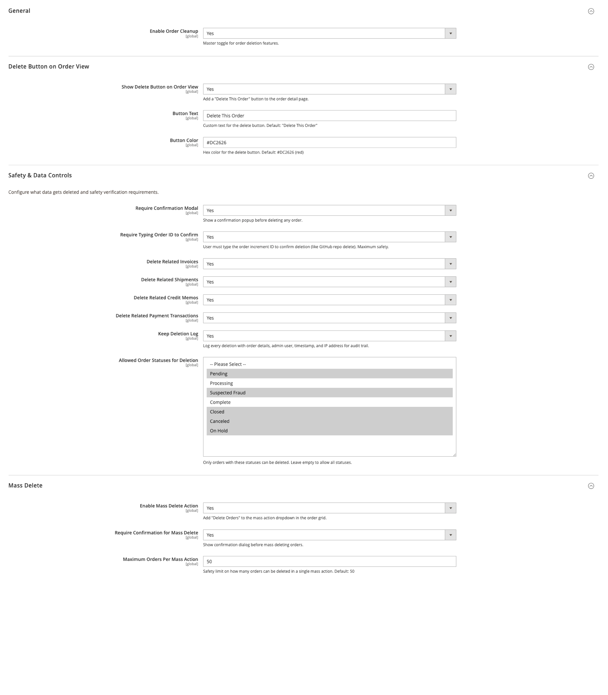
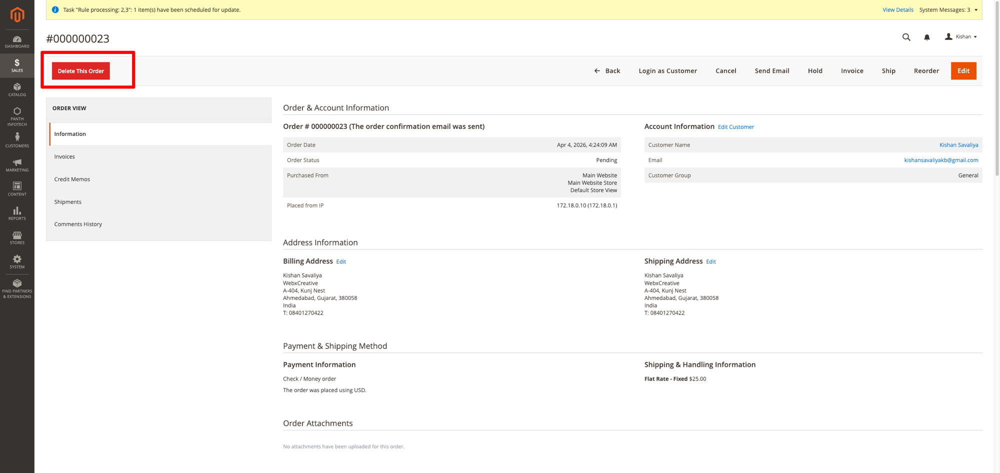
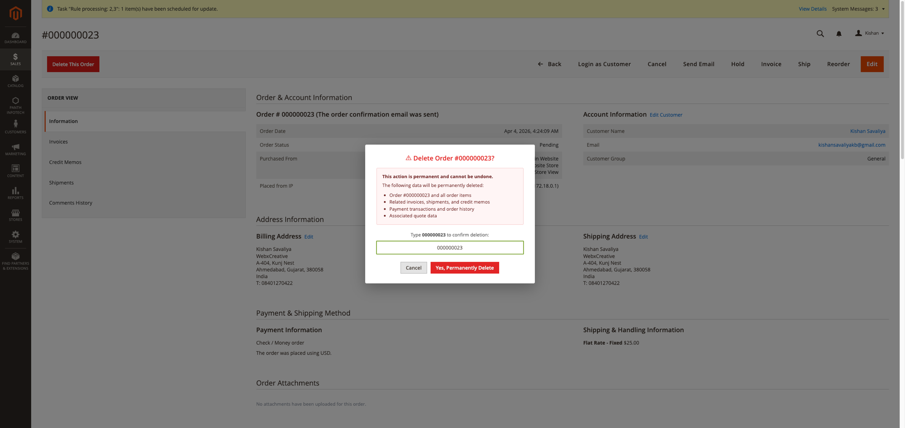
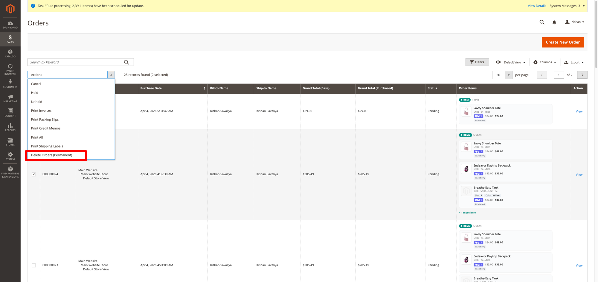
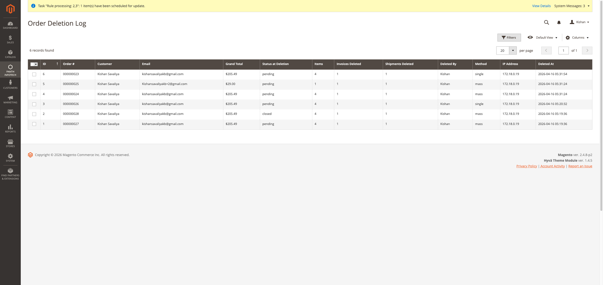

# Magento 2 Order Cleanup

Panth Order Cleanup (module `Panth_OrderCleanup`) adds order deletion to the Magento 2 admin. Magento does not ship with a way to delete orders. This module adds a delete button to the order view page and a mass action to the order grid, both guarded by ACL resources, an optional list of allowed order statuses, a confirmation step and an audit log table. It is an admin-only module with no storefront code. It is used by store owners, developers and agencies who need to remove test, spam or otherwise unwanted orders from a store.

Deletions are permanent: the module deletes rows from the Magento sales and quote tables inside a database transaction and there is no undo, so back up the database before using it on real order data.

Product page: [kishansavaliya.com/magento-2-order-cleanup.html](https://kishansavaliya.com/magento-2-order-cleanup.html)

## Features

- A delete button on the admin order view page. Button text (default "Delete This Order") and background colour (default #DC2626) are configurable.
- A confirmation modal that lists the data about to be removed and, when enabled, requires the admin to type the order increment ID before the "Yes, Permanently Delete" button becomes active. The typed value is sent with the request and checked again on the server.
- A "Delete Orders (Permanent)" mass action in the Sales > Orders grid with an optional confirmation dialog and a configurable maximum number of orders per action (default 50). The action is only listed when the module and the mass action are enabled and the admin user has the mass delete ACL resource.
- Separate Yes/No settings for deleting the order's invoices, shipments, credit memos and payment transactions.
- An "Allowed Order Statuses for Deletion" list. Orders in any other status are refused with an error message. Leave the list empty to allow every status.
- Every deletion, including the deletion log row, runs in one database transaction per order. If any statement fails the transaction is rolled back and an error message is shown.
- A deletion log table (`panth_order_deletion_log`) and an admin grid ("Deletion Log") that record the order number, customer name and email, grand total, currency, status at deletion, item count, a JSON item summary, which related documents were deleted, the admin user name, IP address, method (single or mass) and timestamp.
- Keyword search on the Deletion Log grid (order number, customer name, customer email, deleted by).
- Four ACL resources so that configuration, single deletion, mass deletion and log viewing can be granted to admin roles separately.
- Entries in the Magento system log for every successful and failed deletion.

## Compatibility

| Platform | Versions |
|---|---|
| Magento Open Source | 2.4.4, 2.4.5, 2.4.6, 2.4.7, 2.4.8 |
| Adobe Commerce | 2.4.4, 2.4.5, 2.4.6, 2.4.7, 2.4.8 |
| PHP | 8.1, 8.2, 8.3, 8.4 |

Composer constraints from `composer.json`: `magento/framework` ^103.0, `magento/module-sales` ^103.0, `magento/module-backend` ^102.0, `magento/module-ui` ^101.2.

## Requirements

- Magento Open Source or Adobe Commerce 2.4.4 to 2.4.8.
- PHP ~8.1.0, ~8.2.0, ~8.3.0 or ~8.4.0.
- `mage2kishan/module-core` ^1.0 (module `Panth_Core`). It is loaded before this module (`etc/module.xml` sequence) and declares the `panth` configuration tab and the `Panth_Core::panth_extensions` admin menu parent that this module attaches to.
- Magento modules `Magento_Sales`, `Magento_Backend` and `Magento_Ui` (see the composer constraints above).
- `composer.json` declares no suggested packages.

## Installation

```bash
composer require mage2kishan/module-order-cleanup
bin/magento module:enable Panth_Core Panth_OrderCleanup
bin/magento setup:upgrade
bin/magento setup:di:compile
bin/magento cache:flush
```

Notes:

- `setup:upgrade` creates the `panth_order_deletion_log` table from `etc/db_schema.xml`.
- `setup:di:compile` is only needed when Magento runs in production mode.
- The module ships no files under `view/*/web`, so `setup:static-content:deploy` is not required for this module.

Check the result with:

```bash
bin/magento module:status Panth_OrderCleanup
```

## Configuration

Go to Stores > Configuration > Panth Extensions > "Order Cleanup". Every setting is defined at the default (global) scope only; there are no website or store view overrides. All configuration paths start with `panth_order_cleanup/`. The section is protected by the ACL resource `Panth_OrderCleanup::config`, and the same page is reachable from the "Order Cleanup" > "Configuration" admin menu item.

### General

| Setting | Default | What it does |
|---|---|---|
| Enable Order Cleanup (`general/enabled`) | Yes | Master switch. When No, the delete button is hidden and every delete request, single or mass, is refused with an error message. |

### Delete Button on Order View

| Setting | Default | What it does |
|---|---|---|
| Show Delete Button on Order View (`button/show_on_order_view`) | Yes | Adds the delete button to the order detail page. |
| Button Text (`button/button_text`) | Delete This Order | Text shown on the button. Shown only when the previous setting is Yes. |
| Button Color (`button/button_color`) | #DC2626 | Hex background colour of the button (#RGB or #RRGGBB). Any other value falls back to #DC2626. Shown only when "Show Delete Button on Order View" is Yes. |

### Safety & Data Controls

| Setting | Default | What it does |
|---|---|---|
| Require Confirmation Modal (`safety/require_confirmation`) | Yes | Opens the confirmation modal when the delete button is clicked. When No and "Require Typing Order ID to Confirm" is also No, the browser's native confirm dialog is used instead. When typing the order ID is required, the modal is always shown. |
| Require Typing Order ID to Confirm (`safety/require_type_order_id`) | Yes | The confirm button in the modal stays disabled until the typed value equals the order increment ID. The delete controller also compares the submitted value with the order increment ID and refuses the request if they differ. Applies to the order view button only, not to the mass action. |
| Delete Related Invoices (`safety/delete_invoices`) | Yes | Deletes the order's invoices with their items, comments and grid rows. When No, an order that has invoices is refused, because the database foreign keys would remove the invoices together with the order. |
| Delete Related Shipments (`safety/delete_shipments`) | Yes | Deletes the order's shipments with their items, comments and grid rows. When No, an order that has shipments is refused. |
| Delete Related Credit Memos (`safety/delete_creditmemos`) | Yes | Deletes the order's credit memos with their items, comments and grid rows. When No, an order that has credit memos is refused. |
| Delete Related Payment Transactions (`safety/delete_transactions`) | Yes | Deletes rows from `sales_payment_transaction` for the order. When No, an order that has payment transactions is refused. |
| Keep Deletion Log (`safety/keep_deletion_log`) | Yes | Writes a row to `panth_order_deletion_log` for each deletion, inside the same transaction as the deletion. |
| Allowed Order Statuses for Deletion (`safety/allowed_statuses`) | canceled, closed, holded, pending, fraud | Multiselect of order statuses. Only orders whose current status is in the list can be deleted. Empty means all statuses are allowed. |

### Mass Delete

| Setting | Default | What it does |
|---|---|---|
| Enable Mass Delete Action (`mass_action/enabled`) | Yes | When No, the "Delete Orders (Permanent)" entry is removed from the grid Actions dropdown and the mass delete controller refuses the request with an error message. |
| Require Confirmation for Mass Delete (`mass_action/require_confirmation`) | Yes | When Yes, a confirmation dialog is shown before the mass delete request is sent. When No, the request is sent without the dialog. |
| Maximum Orders Per Mass Action (`mass_action/max_orders_per_action`) | 50 | If more orders than this are selected, nothing is deleted and an error message reports the limit. |

Default behaviour after installation: the module is enabled, the button and the mass action are active, all related documents and transactions are deleted together with the order, the deletion log is kept, and only orders in the statuses canceled, closed, holded, pending or fraud can be deleted.



## Usage

There is no automatic, scheduled or age-based deletion and no store filter. Orders are only deleted when an admin user explicitly chooses them; the module registers no cron jobs and no console commands.

### Selection criteria

`Panth\OrderCleanup\Model\OrderDeleter::deleteOrder()` applies the same checks to every order, whether it comes from the order view button or from the mass action:

1. "Enable Order Cleanup" must be Yes.
2. The order must exist (loaded through `OrderRepositoryInterface`).
3. If "Allowed Order Statuses for Deletion" is not empty, the order's current status must be one of the listed statuses.
4. If any of "Delete Related Invoices", "Delete Related Shipments", "Delete Related Credit Memos" or "Delete Related Payment Transactions" is No, the order must not have documents of that type.

The controllers additionally require the ACL resources `Panth_OrderCleanup::delete_order` (single) or `Panth_OrderCleanup::mass_delete` (mass), and the mass action requires "Enable Mass Delete Action" to be Yes and the selection to be within "Maximum Orders Per Mass Action". When "Require Typing Order ID to Confirm" is Yes, the single delete controller also requires the posted `confirm_increment_id` value to equal the order increment ID.

### Deleting a single order

1. Open Sales > Orders and view an order. The button is shown only when the module is enabled, "Show Delete Button on Order View" is Yes and the admin user has `Panth_OrderCleanup::delete_order`.
2. Click the button. With the confirmation modal enabled, a dialog lists what will be removed; with "Require Typing Order ID to Confirm" enabled, type the order increment ID to activate "Yes, Permanently Delete".
3. Confirm. The form posts to `panth_ordercleanup/order/delete` and you are redirected to the order grid with a success or error message.





### Deleting orders in bulk

1. In Sales > Orders select the orders and choose "Delete Orders (Permanent)" from the Actions dropdown.
2. Confirm the dialog. The request posts to `panth_ordercleanup/order/massDelete`.
3. Each selected order is processed one by one with the checks above. Orders that fail a check are skipped and the others are still deleted. The result message reports how many orders were deleted and how many could not be, with the reasons.



### What is deleted

For every order that passes the checks, the following rows are deleted inside one transaction, in this order:

| Data | Tables | Condition |
|---|---|---|
| Invoices | `sales_invoice_item`, `sales_invoice_comment`, `sales_invoice_grid`, `sales_invoice` | "Delete Related Invoices" = Yes |
| Shipments | `sales_shipment_item`, `sales_shipment_comment`, `sales_shipment_grid`, `sales_shipment` | "Delete Related Shipments" = Yes |
| Credit memos | `sales_creditmemo_item`, `sales_creditmemo_comment`, `sales_creditmemo_grid`, `sales_creditmemo` | "Delete Related Credit Memos" = Yes |
| Payment transactions | `sales_payment_transaction` | "Delete Related Payment Transactions" = Yes |
| Order data | `sales_order_tax_item` (for the order's tax rows), `sales_order_item`, `sales_order_payment`, `sales_order_status_history`, `sales_order_address`, `sales_order_tax`, `sales_order_grid`, `sales_order` | Always |
| Quote | `quote_shipping_rate` (for the quote's addresses), `quote_item`, `quote_address`, `quote_payment`, `quote` | Always, when the order has a `quote_id` |

The deletes are issued directly on the database connection, not through Magento repositories. Inside the transaction the module dispatches the `sales_order_delete_before` and `sales_order_delete_after` events with the order as `order` and `data_object`; an exception thrown by an observer rolls the deletion back. Plugins on the order repository or order resource model do not run. Rows in other tables are removed only if the database schema cascades on foreign keys; rows written by third-party extensions without such constraints are left in place. If any statement fails, the transaction is rolled back and nothing is deleted.

### Deletion log

When "Keep Deletion Log" is Yes, a row is inserted into `panth_order_deletion_log` inside the deletion transaction, so an order is never deleted without its log row. The log data is captured before deletion and keeps: order increment ID and entity ID, customer name and email, grand total and currency, status at deletion, item count and a JSON summary of the visible items (name, SKU, quantity, price), whether invoices, shipments and credit memos were deleted (Yes only when the order had such documents), the admin user name, the admin's IP address, the method (`single` or `mass`) and the deletion timestamp.

The grid is at "Order Cleanup" > "Deletion Log" in the admin menu (route `panth_ordercleanup/log/index`, ACL `Panth_OrderCleanup::view_log`). It supports filtering, sorting, column selection, paging and bookmarks. The grid shows all logged fields except the entity ID, currency, JSON summary and credit memo flag. Email and IP Address are hidden by default and can be shown from Columns.



### System log

Each successful deletion writes an info entry and each failure writes an error entry to the Magento logger, prefixed with `Panth_OrderCleanup:`. If the deletion log row cannot be written, the whole deletion is rolled back and logged as an error.

## Developer Notes

- Module name: `Panth_OrderCleanup`; Composer package: `mage2kishan/module-order-cleanup`; PHP namespace: `Panth\OrderCleanup`.
- Admin route: front name `panth_ordercleanup` (`etc/adminhtml/routes.xml`). Controllers: `Controller\Adminhtml\Order\Delete` (POST, `order_id` and, when typing the order ID is required, `confirm_increment_id` parameters), `Controller\Adminhtml\Order\MassDelete` (POST, uses the UI mass action filter), `Controller\Adminhtml\Log\Index`.
- Deletion logic: `Model\OrderDeleter::deleteOrder(int $orderId, string $method = 'single'): array`. Returns `success`, `message` and, on success, `increment_id`. This is the class to call or decorate if you need to hook into deletions.
- Order view button: `Block\Adminhtml\Order\View\DeleteButton` with template `view/adminhtml/templates/order/view/delete-button.phtml`, added to the `page.main.actions` container by `view/adminhtml/layout/sales_order_view.xml`. Public methods: `canShow()`, `getOrder()`, `getDeleteUrl()`, `getOrderIncrementId()`, `getButtonText()`, `getButtonColor()`, `requireConfirmation()`, `requireTypeOrderId()`.
- Mass action: `view/adminhtml/ui_component/sales_order_grid.xml` adds the `panth_delete_orders` action to `sales_order_grid`, using the component class `Ui\Component\MassAction\DeleteAction`, which hides the action and removes its confirmation dialog according to the configuration and ACL.
- Deletion log grid: UI component `panth_order_deletion_log_listing` (layout handle `panth_ordercleanup_log_index`), data source collection `Model\ResourceModel\DeletionLog\Grid\Collection`, resource model `Model\ResourceModel\DeletionLog`.
- `etc/di.xml` registers the grid collection with the UI `CollectionFactory` and registers the module name with `Panth\Core\ViewModel\ThemeConfig`. There are no plugins, preferences, observers, cron jobs, console commands or web API endpoints.
- ACL resources (`etc/acl.xml`): `Panth_OrderCleanup::config` (under Stores > Configuration), `Panth_OrderCleanup::delete_order`, `Panth_OrderCleanup::mass_delete` and `Panth_OrderCleanup::view_log` (under Sales).
- Admin menu (`etc/adminhtml/menu.xml`): "Order Cleanup" group under `Panth_Core::panth_extensions` with the items "Deletion Log" and "Configuration".
- Database table (`etc/db_schema.xml`): `panth_order_deletion_log` with columns `log_id` (primary key), `order_increment_id`, `order_entity_id`, `customer_name`, `customer_email`, `grand_total`, `order_currency`, `order_status`, `items_count`, `items_summary`, `invoices_deleted`, `shipments_deleted`, `creditmemos_deleted`, `deleted_by`, `ip_address`, `deletion_method`, `deleted_at`; indexes on `order_increment_id`, `deleted_by` and `deleted_at`.
- Configuration scope: default only (`showInWebsite="0"`, `showInStore="0"`).

## Uninstallation

```bash
bin/magento module:disable Panth_OrderCleanup
composer remove mage2kishan/module-order-cleanup
bin/magento setup:upgrade
bin/magento setup:di:compile
bin/magento cache:flush
```

These steps do not drop the `panth_order_deletion_log` table and do not remove the `panth_order_cleanup/*` rows from `core_config_data`; delete them manually if you no longer need the audit history. Orders that were deleted with the module are not restored.

## Support

- Product page: [kishansavaliya.com/magento-2-order-cleanup.html](https://kishansavaliya.com/magento-2-order-cleanup.html)
- Contact form: [kishansavaliya.com/contact](https://kishansavaliya.com/contact)
- Email: kishansavaliyakb@gmail.com
- GitHub issues: [github.com/mage2sk/module-order-cleanup/issues](https://github.com/mage2sk/module-order-cleanup/issues)

## License

Proprietary, as declared in `composer.json`. The package is published on Packagist and can be installed with Composer; see the product page for the terms of use.

## Changelog

See [CHANGELOG.md](CHANGELOG.md).

## Links

- Website: [kishansavaliya.com](https://kishansavaliya.com)
- All extensions: [kishansavaliya.com/magento-extensions.html](https://kishansavaliya.com/magento-extensions.html)
- GitHub: [github.com/mage2sk/module-order-cleanup](https://github.com/mage2sk/module-order-cleanup)
- Packagist: [packagist.org/packages/mage2kishan/module-order-cleanup](https://packagist.org/packages/mage2kishan/module-order-cleanup)
